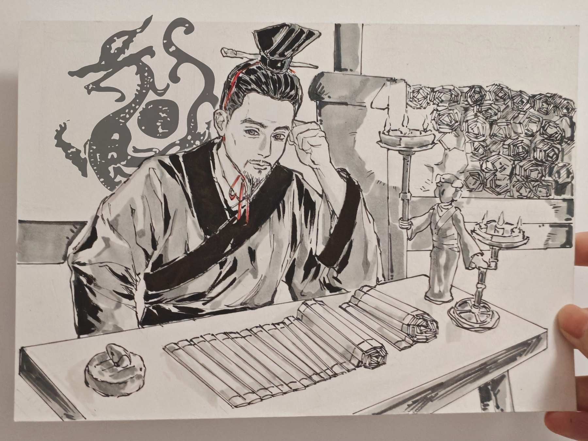

# 李冰：从史书到神话（1）

如果说有一个名字，能让一条江河安静下来，让一块平原丰饶两千年，那一定是“李冰”。

但是，我们今天熟知的李冰，和两千年前书里的李冰，是同一个人吗？

最早的李冰，是个官。

他是秦国派往蜀地的郡守，在战国中后期主持水利工程。按照那位四川学者论文中系统梳理的，早期历史记载重在凿离堆、通航道，重心偏向交通与工程。

这其中并没有太多神怪色彩。没有杀龙，没有斩蛟，也没有神兵天降。他只是一个懂水势、识地脉、顺自然的技术官员。

> 《史记》：蜀守冰凿离碓，辟沫水之害；穿二江成都之中

干净、克制、理性。

这很華夏。

颛顼“**绝地天通**”，断绝了别人天地沟通的权利，让華夏第一次摆脱神权，并将其置于王权之下，使政治秩序取代神权狂热，奠定了華夏文明的基础。

从先秦到汉代的精神，華夏的主流精神是敬天而不滥神，是顺势而为而不是用神通对抗自然。

因此，在最早的史书里，李冰不是神。

他是制度官员，是国家意志（秦）的执行者。

但问题来了，一个改变一方山河命运的人，真的会只停留在技术官员的层面吗？

显然不会。

所以，到了《华阳国志》里，事情开始转向。

你发现，他开始和鬼神打交道了。

这里的李冰，不只是开渠修堰，他还会与江神约盟、立三石人镇水、与江神斗。

> 自涉邮作三石人，立三水中，与江神要
> 冰凿崖时，水神怒，冰乃操刀入水中，与神斗，迄今蒙福

再往后，《太平广记》甚至记载他化作牛形入水斩蛟。

> 冰乃入水戮蛟，己为牛形.....冰神为龙，复与龙斗于灌口

你看，一个郡守，慢慢长出神性。

但这难道就是后世附会、是某些进步分子口中的“封建迷信”吗？

不，这是蜀地百姓百年的选择。

这是民间理解治水这件事的方式。

对于山地部族与早期农业社会而言，洪水关乎着生死。

谁能治水，谁就等于战胜了自然神力。

于是，逻辑自然转变为：

水患 → 妖物化；工程 → 斩蛟；技术 → 神力。

神话思维的再加工。

或者更准确更专业地说，是**历史神话化**。

这里就要先指出本系列下次要提到的二郎神——灌口郎君神，其发展则是神话历史化，与李冰传说演变一体两面。

但不管是二郎神还是李冰，为什么这种现象都在蜀地发生？

学界已有讨论，四川地区神话传统时间较长。

地方社会在进入帝国秩序（秦）之后，仍然会保留原有较浓厚的自然崇拜与祖先英雄神传统。

当秦国并和蜀地，就发生了一次融合。

于是李冰正好成为这一传统与国家工程之间的桥梁。

他既是秦官，又被吸纳进蜀地英雄神谱系。

这也是为什么都江堰崇德庙的前身是纪念治水蜀王的望帝祠。

也就是说，在李冰之前，蜀地本就有治水先王的信仰传统（望丛二帝）。

而当李冰完成治水工程之后，他自然被纳入这一祖先英雄序列。

此为传承。

因此，李冰传说的第一次转身，并不是从无到有的虚构。

从“国家工程官员” 到 “地方英雄神”的转型，这本质上是華夏文明结构内部的变化。

在《史记》里，他属于制度秩序。

在《华阳国志》里，他进入神话秩序。

两者之间，共同构成了華夏文明的一种独特现象，即我们可以用理性治水，也可以用神话记住治水的人。

理性是方法，神话是记忆

而李冰的神性，则是对華夏治水技术成果的永恒化。

