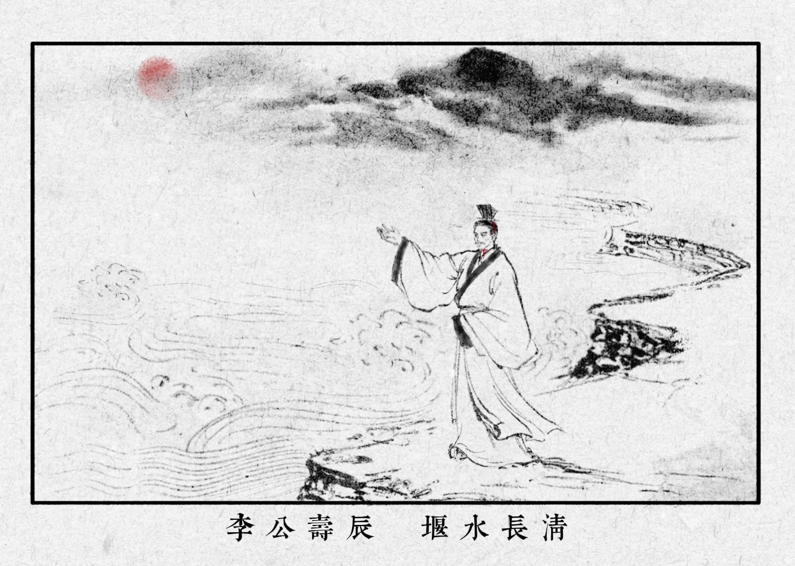

# 岁暮祭李公文

时维乙巳腊尽，序属新元。玉垒云崖尚勒秦斧之痕，岷江雪浪犹激漢世之风。

缅惟昔时，蜀郡守李公冰者，名镌堰石，功被西川。劈离堆以导洪波，穿二江而润沃野。石犀镇水，蛟螭潜形。竹笼垒岸，涛浪归漕。此岂虚言哉？实乃万姓之夙愿，累代所积成也。

按蜀志¹所载，冰公明天纬地，立祠江渎以正水文。其泽岂止于当代？『深淘滩，低作堰』²，六字昭如星斗，法可依而道可传。故自漢兴以降，祀典弗绝，民心有寄。今人所奉，亦非渺茫之神祇，乃润物利生之实迹耳。

溯及華夏治水之统，自大禹敷土，其要在疏导衡平，而不与水争力。不假神权，唯恃民智与笃行。斯文脉之所以延绵，其根柢或在于是！

进而论之，治水之法，实通治世之纲。禹贡³列五服之制，自甸及荒，以本为尊，以远为次。文教固于内，武卫彰于外，故气象广被，天下向化。今若反其道，摇根本以丰枝叶⁴，则外饰虽繁，中干已朽。譬犹毁堰求安，洪未至而溃势已成。其衰也非关天命，其隳也非由岁时，自弃其本耳。

今值岁晚，霜凝古堰。冰公虽邈，典则犹存。神话虽玄，精魄可接⁵。

当此元正肇启，惟愿来岁之華夏，效冰公之明察，承古圣之权衡。持淘滩作堰之淳智，弃伤本涸源之妄为。使川流不紊，大势无逆，纲纪有托，烝庶有依。斯道不坠，则统绪可续，礼乐常新，共山河而久固，并日月而长明。

谨缀此文，以贺丙午，敬仰前修，续书新章。

                                                                                   公曆二零二六年一月二十日

​                                                                                                                       中華律曆

​                                                                                                       陰曆建寅臘月初二

​                                                                                                     陽曆建丑正月貳拾日 

​                                                                                                         干支己丑月丁丑日 

​                                                                                                                     歲在乙巳年

​                                                                                                                  共和七十六年 

​                                                                                                   大明永曆三百七十九年

​                                                                                                       大漢元始二〇二五年

​                                                                                                    黃帝紀年一一〇二二年

注：

1. **蜀志**：即《华阳国志·蜀志》。原文载“冰乃壅江作堋，穿郫江、检江，别支流双过郡下，以行舟船……又溉灌三郡，开稻田。”此为李冰修建都江堰功绩的原始史料来源。
2. **深淘滩，低作堰**：此六字要诀，为前人概括都江堰“因势利导、岁修常治”之理。文中言其“法可依而道可传”，意在指出此种尊重规律、注重平衡、不妄求速效的原则，实与稳健务实的治理智慧同源共理。
3. **禹贡**：即《尚书·禹贡》。原文载“自甸服五百里乃至侯服，自绥服五百里乃至荒服，揆文教，奋武卫。”文中引此，意在由李冰治水溯源至大禹传统，并借“五服”之制阐明“以本为尊，以远为次”的治理秩序，强调先固根本、再及枝叶的文明存续逻辑。先固其内，方能化其外，若本末倒置，则礼崩乐坏。
4. **摇根本以丰枝叶**：此句化用《贞观政要》“中国百姓，天下根本，四夷之人，犹于枝叶。扰其根本，以厚枝叶，而求国安，未之有也。自古明王，信化中国，权驭夷狄”。此处所批评者，并非变化本身，而是牺牲根本以换取表面繁盛的短视之政。堰毁则水乱，根摇则国危，二者理脉相通，皆喻本末不可倒置。
5. **神话虽玄，精魄可接**：此句意在区分作为历史记忆外壳的神话与作为華夏文明精神内核的精魄。所谓“可接”，乃后人在实践与秩序中继续印证其合理性，而非凭空膜拜。意在强调本文主旨：敬先贤，不奉神权；尊传统，不废理性。